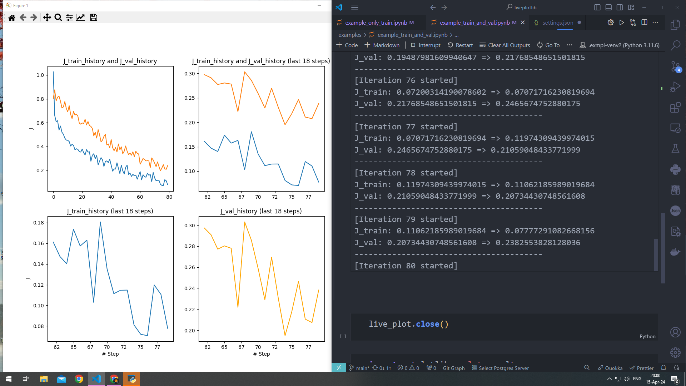

# LIVE PLOT LIBrary (liveplotlib)
- Library for plotting (visualizing) cost function changes during model training (in real time)



- please, check [compatibility](#compatibility) to see if this library meets your needs and environment

# Notations
### Specific 
- `J` - cost/loss function <br>
It measures how well does your model performs and used for optimization of your model

- `J_history` - python list (of numbers), that contains previous values of J <br>
(for example, in previous epochs)

For subsets
- `J_train_history` - **J_history**, where J was calculated **on train subset** 
- `J_val_history` - **J_history**, where J was calculated **on val subset**
- `J_test_history` - **J_history**, where J was calculated **on test subset**

### General
- `plotting` - visualizing, making graph
- `train/val/test` - subsets of your original dataset

- `train` - train subset. <br>
Used for optimizing the model parameters (weights and biases)

- `val`/`valid` - validation subset <br>
(aka Cross-Validation (cv) or DEVeleopment (dev) subset). Used for optimizing the hyperparameters of your model (for example: learning_rate or regularization term)

- `test` - test subset, used for testing how your model performs on new data

- `epoch` - 1 iteration through the whole dataset (or subset). <br>


# Installation
```shell
>> pip install liveplotlib
# all dependencies will be installed automatically
```

# Usage
- Only 5 steps!
- "foo" in names means "this is just for example, it means nothing"

- Basic functionality:
    ```python
    from liveplotlib import LivePlotOnlyTrain

    J_train_history = []

    # begin session
    live_plot = LivePlotOnlyTrain()

    # update during training
    # J_train_history.append(new_J_train)
    live_plot.update(J_train_history)

    # end session
    live_plot.close()

    # (See explanations below)
    ```

## Option 1: plot only J_train_history
```python
# STEP 1: IMPORT

from liveplotlib import LivePlotOnlyTrain  


# ...............
# Some operations with data
# ................


# STEP 2: CREATE HISTORY LIST

# Along with model initialization, create empty J_train_history as well
model = FooSomeModelClass() 
J_train_history = []


# STEP 3: INITIALIZE LIVE PLOT

# Right before training
live_plot = LivePlotOnlyTrain()


# STEP 4: UPDATE DURING TRAINING

# -----Inside train function loop-----
# ...
# new_J_train = ...
# ...
J_train_history.append(new_J_train)
# ...
live_plot.update(J_train_history)
# ...
# ------------------------------------


# STEP 5: END SESSION

# In the end (especially important in jupyter notebooks)
live_plot.close()
```


## Option 2: plot J_train_history and J_val_history
```python
# STEP 1: IMPORT

from liveplotlib import LivePlotTrainAndVal 


# ...............
# Some operations with data
# ................


# STEP 2: CREATE HISTORY LISTS

# Along with model initialization, create empty J_train_history and J_val_history as well
model = FooSomeModelClass() 
J_train_history = []
J_val_history = []


# STEP 3: INITIALIZE LIVE PLOT (START SESSION)

# Right before training
live_plot = LivePlotTrainAndVal()


# STEP 4: UPDATE DURING TRAINING

# -----Inside train function loop-----
# ...
# new_J_train = ...
# new_J_val = ...
# ...
J_train_history.append(new_J_train)
J_val_history.append(new_J_val)
# ...
live_plot.update(J_train_history, J_val_history)
# ...
# ------------------------------------


# STEP 5: END SESSION

# In the end (especially important in jupyter notebooks)
live_plot.close()
```


# About

### What does it do

-   This tool `plots Cost (loss) function` changes `in real time in separated window` (during training, not after its done) so you could see tendencies and diagnose/manage your optimization process more easily.

### Who is it created for

-   This `python library` is created for data scientists / ML engineers / data analysts or anyone else interested

### Under the hood

-   written on top of matplotlib library, using its figures, subplots and lines mechanics

### Compatibility
-   **it works only if you are running it on your local machine**. <br>
(It can't run in Google colab, because google colab's notebooks run on a remote server, so you can't exit inline mode => it will give you an error if you try). <br>
If you have any ideas how to fix this, please, feel free to propose such important improvement ))
-   **compatible with `.py` and `.ipynb` (jupyter notebook) files**
-   It automatically determines a caller file's format and takes appropriate actions

# How to
## Change slice size
Slice size is calculated in each `.update()` by formula:

```python
slice_size = slice_fraction * len(J_history) + slice_bias
```
where slice_fraction and slice_bias are parameters of `.__init__()` function (used for initializing live_plot). <br>

So, if you want to add some fixed number to amount of steps to plot, increase slice_bias. If you want to make a scalable, dynamic change (like increase fraction) - then, of corse increase slice_fraction


# Recomendations
### If you are using LivePlotTrainAndVal
- Ensure, that your J_train_history and J_val_history have the same length.
- Update once in epoch <br>
If you are using minibaches, then calculate J_train and J_val across all minibatches (average). Then, as always:
    ```python
    # In the end of epoch
    J_train_history.append(J_train)
    J_val_history.append(J_val)
    live_plot.update(J_train_history, J_val_history)
    ```

# Comments
- name "liveplotlib" comes from its "parent" library - matplotlib. (liveplotlib is written on top of matplotlib)
- please, feel free to give me feedback, propose some improvements/new functionality  or report a bug.